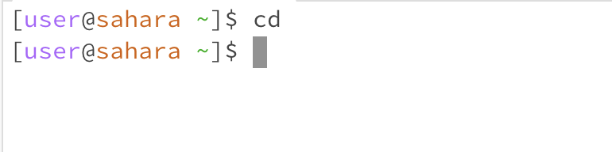
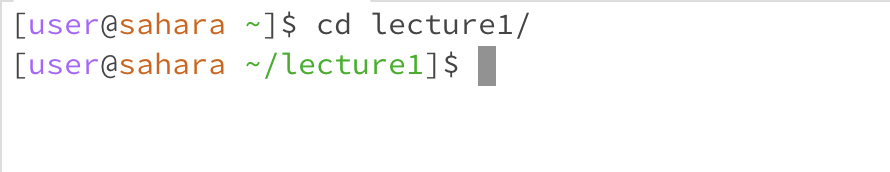
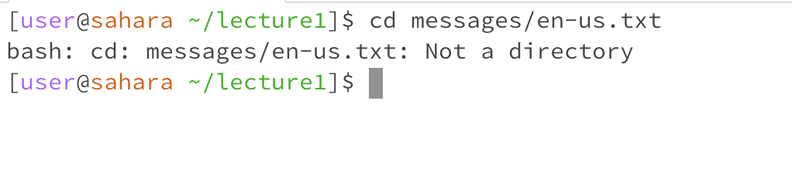
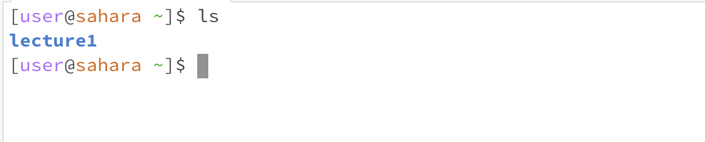
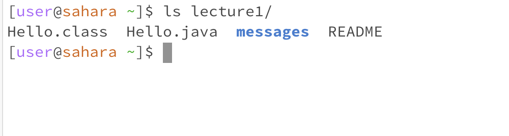
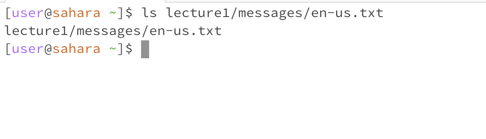
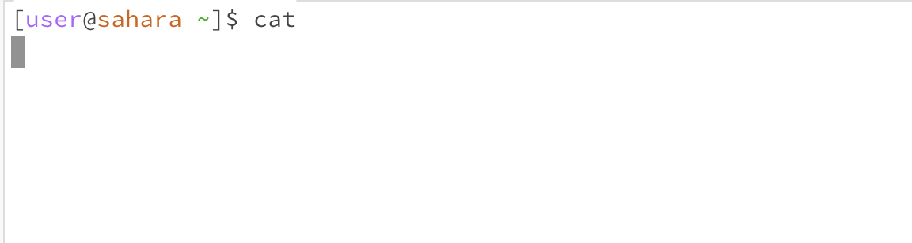
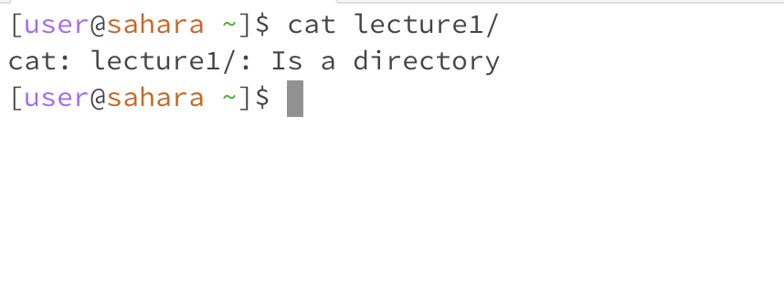
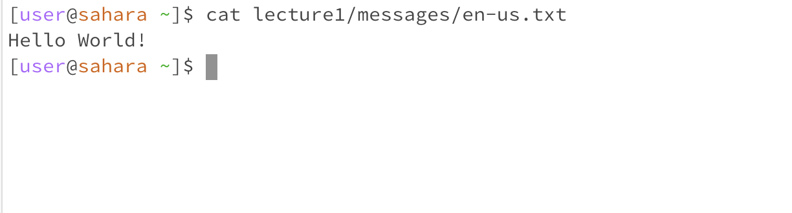

# Hi this is Charlie Shang
## Lab 1 Report
1. cd with no argument

2. cd with directory argument

3. cd with file argument

4. ls with no argument

6. ls with directory argument

7. ls with file argument

8. cat with no argument

9. cat with directory argument

10. cat with file argument

