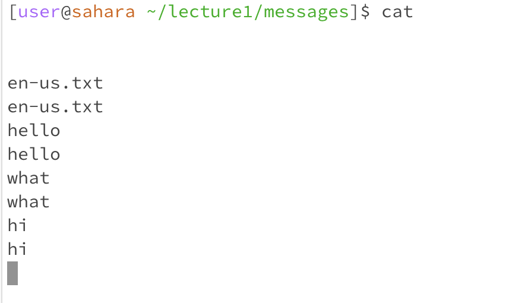

# Hi this is Charlie Shang
## Lab 1 Report
### 1. `cd` with no argument
 
* working directory: `/home/lecture1/messages`
* There are no output, because `cd` means change directory and will not give output. Also, the directory changes from the working directory to the `~` directory, which is `/home` directory. Therefore, if we provide no argument for `cd`, it will change the current directory to the `/home` directory.
* The output is not an error. `cd` nothing means changing the current directory to the `/home` directory.

### 2. `cd` with directory argument
 
* working directory: `/home`
* As above mentions, `cd` does not generate output. However, since here we have a directory as an argument, our directory actually changes. The directory changes from `/home` to `/home/lecture1`. If the argument is something other than `lecture1`, the directory will not change because under `/home`, there is only one directory which is `/lecture1`.
* The output is not an error. It successfully changes the directory from `/home` to `/home/lecture1`.

### 3. `cd` with file argument
 
* working directory: `/home/lecture1`
* There is an output which shows that file `en-us.txt` is not a directory.
* The output is an error. Passing in a file as the argument does not make sense because `cd` means change directory, and the argument of cd has to be a existing directory. Otherwise, it will cast error. In this case, `en-us.txt` is a file instead of a directory, which is the reason that error occurs.

### 4. `ls` with no argument
 
* working directory: `/home`
* The command `ls` without argument means list the directories or files under the current directory. Therefore, the working directory is `/home`, so the output is what in the `/home` directory, which is `lecture1` directory. 
* The output is not an error. `ls` without argument is printing out what is in the working directory.

### 5. `ls` with directory argument

* working directory: `/home`
* The command `ls` with argument means list the name of directories or files under the directory given as argument. As we are in `/home` directory, and the argument we pass in is `/lecture1`, it will show the name of all directories and files under `/home/lecture1`, which is exactly what the output is.
* The output is not an error. It correctly outputs the name of directories and files under the argument we pass in.

### 6. `ls` with file argument

* working directory: `/home`
* I actually have never tried to pass in a file as the argument of `ls` before. According to the output shown on the picture and several tests I tried on my own terminal, I found that `ls` with file passed in as argument prints the directory of the file starting from the working directory. According to the picture above, we are at `/home` directory, and the argument passed in is `en-us.txt` file under `/home/lecture1/message`. The output is `lecture1/message/en-us.txt`, which is the directory of the file starting from the working directory.
* Although I am not sure, I do not think this is an error. I think `ls` used with a file should print its directory starting from the working directory.

### 7. `cat` with no argument

* working directory: `/home/lecture1/messages`
* There is no output. However, the terminal kept running and waited for user input. After I used `cat` withouth any argument, the terminal went to a new line and waited for input. After I typed something on the keyboard as input and pressed enter, the thing I typed was displayed on the terminal again, which means that the terminal repeated the input once. Then the terminal waited for input again. This process only stopped when I clicked on `ctrl+C`. Therefore, if I use `cat` with no argument, it will keep the terminal running and waiting for user input. If the terminal gets input from user, the terminal will repeat the input once and wait for a new input until the user stops this process by `ctrl+C`.
* It is not an error. `cat` without argument keeps the terminal running and waiting for user input and repeating the input once if it gets one until the user stops this process. I think this is they way how `cat` is designed for cases with no argument.

### 8. `cat` with directory argument

* working directory: `/home`
* The output is a message saying that `/lecture1` is a directory. This message occurs because `cat` command is to read data from the file passed as an argument and prints the content. The argument has to be a file, not a directory. Therefore, the terminal is warning us that the argument we pass in is not what `cat` wants.
* It is an error, because `cat` should get a file as an argument to correctly print the content of the file as output. Since we pass in a directory as argument, the error occurs.

### 9. `cat` with file argument

* working directory: `/home`
* The output is `Hello World!`, which is the content in the file `en-us.txt`. As mentioned above, `cat` reads data from the file passed as an argument and prints the content. Since we successfully pass a file as the argument, the terminal correctly prints out the content in that file.
* It is not an error, because we pass in argument as `cat` wants, which is a file. Therefore, the terminal successfully prints the correct output.
