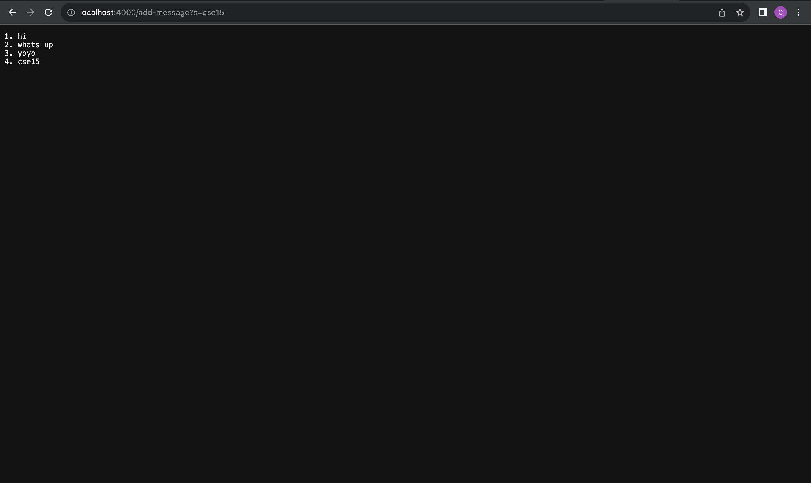
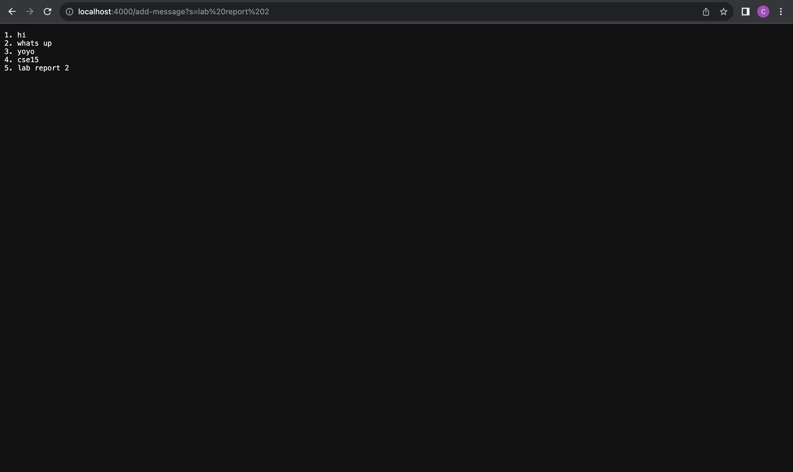
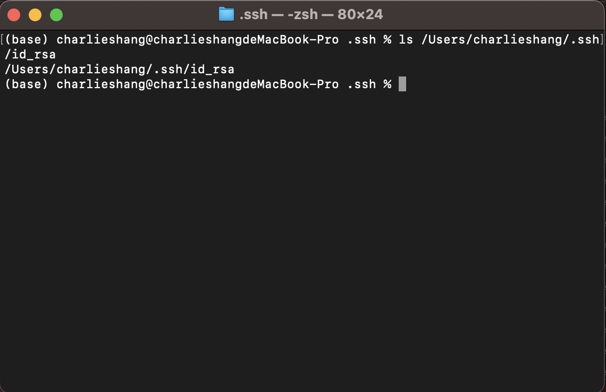
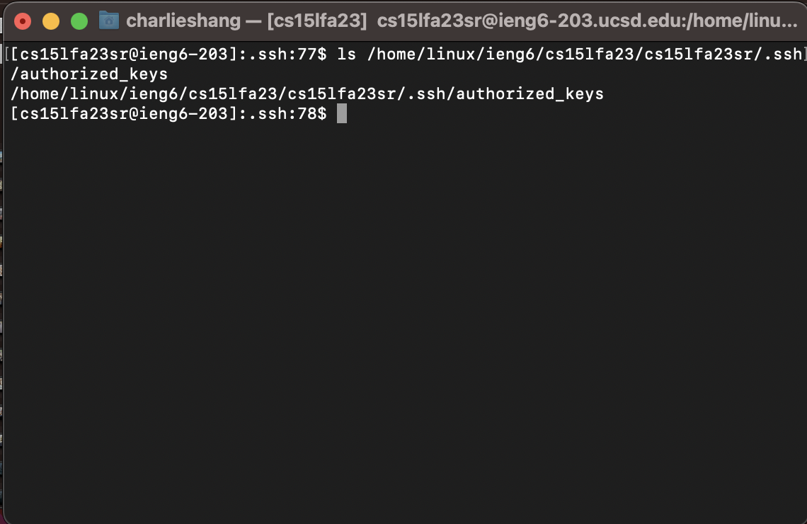
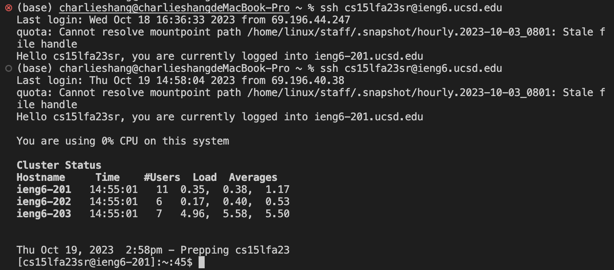

# CSE15L Lab Report Charlie Shang
## Lab 2 Report
### Part 1
```
import java.io.IOException;
import java.net.URI;


class Handler implements URLHandler {
    // The one bit of state on the server: a number that will be manipulated by
    // various requests.
    String words = "";
    int count = 0;

    public String handleRequest(URI url) {
        if (url.getPath().equals("/")) {
            return words;
        } else if (url.getPath().contains("/add-message")) {
            String[] parameters = url.getQuery().split("=");
            if (parameters[0].equals("s")) {
                count += 1;
                words += (count + ". " + parameters[1] + "\n");
                return words;
            } else {
                return "wrong argument";
            }
        } else {
            return "404 Not Found!";
        }

    }
}

class StringServer {
    public static void main(String[] args) throws IOException {
        if(args.length == 0){
            System.out.println("Missing port number! Try any number between 1024 to 49151");
            return;
        }

        int port = Integer.parseInt(args[0]);

        Server.start(port, new Handler());
    }
}
```
<br />
* Method `handleRequest` in the class `Handler` is called when I add `add-message` to the url. Method `main` in the class `StringServer` is called to start the server.
* The argument of `main` in the class `StringServer` is the port number as a command line argument which the user needs to input when the user runs the program. Here I input `4000` as the port number. The argument of `handleRequest` in the class `Handler` is a URI object which is the url of the website. For this screenshot the argument is `https://localhost:4000/add-message?s=cse15`. The values of the class include a String called `words` that records the input from the user by using the `add-message` query. `words` now is `hi\n2. what's up\n3. yoyo\n4. cse15\n`. `\n` means new line character. There is another value called `count` which is an integer that counts the number of string the user gives to the server. This counter also works to provide the index of string that shows on the website. `count` now is 4.
* Both `words` and `count` changes. Since I input the `/add-message?s=cse15`, I input a new string so `words` changes from `1. hi\n2. what's up\n3. yoyo\n` to `1. hi\n2. what's up\n3. yoyo\n4. cse15\n`. `count` also changes from 3 to 4 because there are previously 3 strings and now I input a new one which makes the number of strings to 4.
<br />
* Method `handleRequest` in the class `Handler` is called when I add `add-message` to the url. Method `main` in the class `StringServer` is called to start the server.
* The argument of `main` in the class `StringServer` is the port number as a command line argument which the user needs to input when the user runs the program. Here I input `4000` as the port number. The argument of `handleRequest` in the class `Handler` is a URI object which is the url of the website. For this screenshot the argument is `https://localhost:4000/add-message?s=lab%20report%202`. I actually input `/add-message?s=lab report 2`, and I think the server automatically uses escape character to represent space, which is `%20`. The values of the class include a String called `words` that records the input from the user by using the `add-message` query. `words` now is `hi\n2. what's up\n3. yoyo\n4. cse15\n5. lab report 2\n`. There is another value called `count` which is an integer that counts the number of string the user gives to the server. This counter also works to provide the index of string that shows on the website. `count` now is 5.
* Both `words` and `count` changes. Since I input the `/add-message?s=lab%20report%202`, `words` changes from `hi\n2. what's up\n3. yoyo\n4. cse15\n` to `hi\n2. what's up\n3. yoyo\n4. cse15\n5. lab report 2\n`. `count` also changes from 4 to 5 because there are previously 4 strings and now I input a new one which makes the number of strings to 5.

### Part 2
private key for my SSH on my local computer <br />
/Users/charlieshang/.ssh/id_rsa
<br />
public key for my SSH on the ieng6 computer <br />
/home/linux/ieng6/cs15lfa23/cs15lfa23sr/.ssh/authorized_keys
<br />
logging into ieng6 computer without a asking for a password
<br />

### Part 3
I learned a way to set up a private password for SSH so that I do not need to enter my password every time I log into the school computers. I also learned how to create a github pages by using markdown language, which is really fun. I learned how to use some new unix commands `cat` and `man`. I learned how the url works, including the domain, path, query, and anchor. I learned to use query to change some features demonstrated on the webpage.
