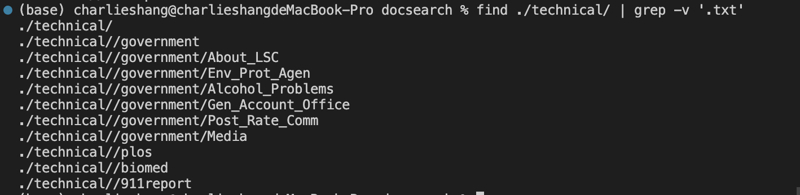
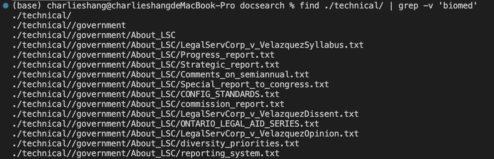
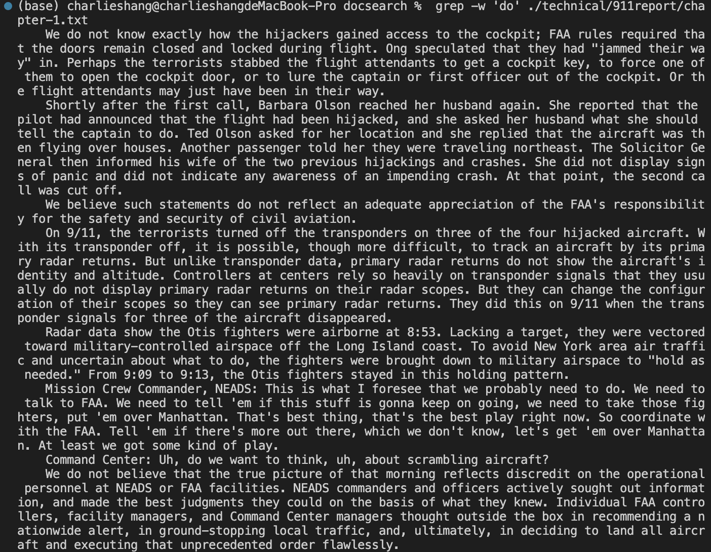
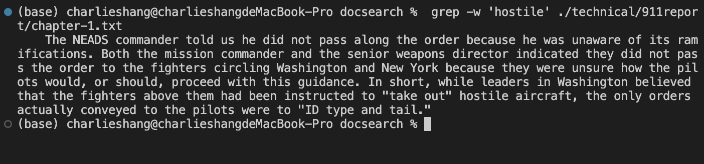
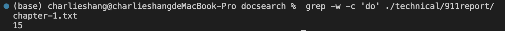
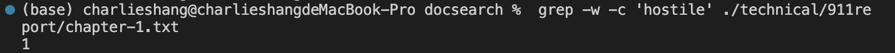
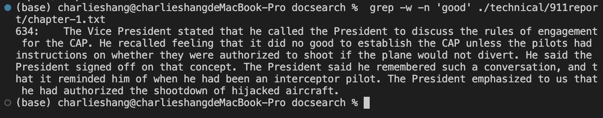
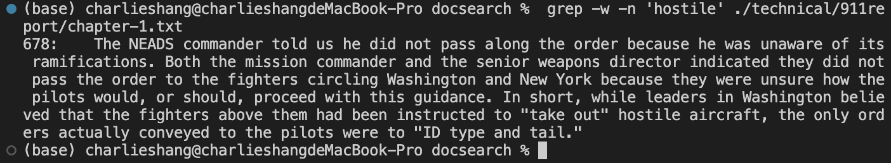

# CSE15L Lab Report Charlie Shang
## Lab 3 Report
### Part 1
I choose the method `reverseInPlace`.
The failure-inducing input is the int array `[1,2,3,4]`.
The code of the buggy program is the following:
```
public class ArrayExamples {

  // Changes the input array to be in reversed order
  static void reverseInPlace(int[] arr) {
    for(int i = 0; i < arr.length; i += 1) {
      arr[i] = arr[arr.length - i - 1];
    }
  }

}
```
The code of the junit test is the following:
```
import static org.junit.Assert.*;
import org.junit.*;

public class ArrayTests {
	@Test 
	public void testReverseInPlace() {
    int[] input1 = { 1, 2, 3, 4 };
    ArrayExamples.reverseInPlace(input1);
    assertArrayEquals(new int[]{ 4, 3, 2, 1 }, input1);
	}

}
```
The bash script I use to run the code is the following:
```
javac -cp .:lib/hamcrest-core-1.3.jar:lib/junit-4.13.2.jar *.java
java -cp .:lib/hamcrest-core-1.3.jar:lib/junit-4.13.2.jar org.junit.runner.JUnitCore ArrayTests
```

The input that does not induce a failure is `[1]`.
The codes of the buggy program and the bash script are the same as above.
The code of the junit test is the following:
```
import static org.junit.Assert.*;
import org.junit.*;

public class ArrayTests {
	@Test 
	public void testReverseInPlace() {
    int[] input1 = { 1 };
    ArrayExamples.reverseInPlace(input1);
    assertArrayEquals(new int[]{ 1 }, input1);
	}

}
```

The symptom of the first failure-inducing test is that the test fails to pass because the element at index 2 does not match the correct result, which is the following:
<br />
The symptom of the second non-failure-inducing test is that it passes the test, which is the following:
<br />

The bug of the program is that the `for` loop goes over the whole array, and every iteration it assigns the element at the back of the array to the front of the array, that is, assigning `array[n-i-1]` to `array[i]`. The problem is that since the `for` loop goes over the whole array, after the `for` loop goes over the first half of the array, which means the first half of the array now already contains the elements of the second half of the array, the `for` loop will continue assigning the elements at the first half of the array to the second half of the array. However, since now the first half is already altered, it no longer contains the original elements of the first half of the array. Therefore, for the iterations of the `for` loop going over the second half of the array, it will just assign the altered values to the second half of the array, and these altered values are just the elements of the second half of the array. For example, if I have `[1,2,3,4]`. After the `for` loops goes over the first half the array, the array will become `[4,3,3,4]`. Therefore, when the `for` loop goes over the second half of the array, it will just assign 3 to 3 and 4 to 4, which makes the result `[4,3,3,4]`.
The buggy program is the following:
```
public class ArrayExamples {

  // Changes the input array to be in reversed order
  static void reverseInPlace(int[] arr) {
    for(int i = 0; i < arr.length; i += 1) {
      arr[i] = arr[arr.length - i - 1];
    }
  }
  
}
```
The fixed program is the following:
```
public class ArrayExamples {

  // Changes the input array to be in reversed order
  static void reverseInPlace(int[] arr) {
    for(int i = 0; i < arr.length / 2; i += 1) {
      int temp = arr[i];
      arr[i] = arr[arr.length - i - 1];
      arr[arr.length - i - 1] = temp;
    }
  }

}
```
I make the `for` loop just go over half of the array, and in every iteration, the program changes element at the current index as well as its corresponding index at the second half of the array. Therefore when `i=0`, the program switches the element stored at index `0` and index `n-i-1` which is `n-1` which is the last index. Also, the program now does not assign values directly. It first stores the element at the current index to a temporary variable such that when we switch the values at the two indexes, we make sure that we are switching the original values instead of the altered ones just as the what the buggy program does. This program stores the value in a temporary variable, and then assigns the value stored in the corresponding index of the second half of the array to the current index of the first half of the array, and then store the temporary variable, which is the original value at the index of the first half of the array, to the index at the second half of the array. Therefore, the switch completes. Going over just half of the array in the `for` loop is because during one iteration we already switches the array at the first and second half of the arrays and we do not want to switch back when going over the second half of the array.

### Part 2
I choose `grep` and the four command-line options include `-v -w `<br />
1. 1st example of `-v`<br />
The command line code is the following:
```
find ./technical/ | grep -v '.txt'
```
The output is the following:
<br />
What this line does is to first find the name of all the directories and files under `./technical` and use them as input for `grep`. `grep` will find everything that does not contain `.txt`. The command-line option `-v` means invert matching. It makes `grep` outputs everything does is not matching the given pattern.
This is useful when we want to find some files with extention other than `.txt`. Furthermore, we can find files or directories by setting up a starndard about what we do not want to find, and the command-line option `-v` does this job.

2. 2nd example of `-v`<br />
The command line code is the following:
```
find ./technical/ | grep -v 'biomed'
```
The output is the following:
<br />
What this line does is to first find the name of all the directories and files under `./technical` and use them as input for `grep`. `grep` will find everything that does not contain `biomed`. Therefore, the output will be every directories and files under `/technical` except `/technical/biomed` under it.
This is useful when we have too many files that have similar names and want to find some files or directories that have distinct names other than the normal pattern of the similar names.

[source:https://man7.org/linux/man-pages/man1/grep.1.html](https://man7.org/linux/man-pages/man1/grep.1.html)

3. 1st example of `-w`<br />
The command line code is the following:
```
grep -w 'do' ./technical/911report/chapter-1.txt
```
The output is the following:
<br />
What this line does is to find all the lines that contains the separate word `do` in the file `./technical/911report/chapter-1.txt`. The command-line option `-w` means find the given pattern as a whole word.
This is useful when some files contain ambiguous words such as do and doing. Command-line option `-w` is useful when we just want to find single whole words.

4. 2nd example of `-w`<br />
The command line code is the following:
```
grep -w 'hostile' ./technical/911report/chapter-1.txt
```
The output is the following:
<br />
What this line does is to find all the lines that contains the separate word `hostile` in the file `./technical/911report/chapter-1.txt`. The command-line option `-w` means find the given pattern as a whole word.
This is useful when we just want to find how a given pattern occurs separately as a word in a file instead of being combined with others.

[source:https://man7.org/linux/man-pages/man1/grep.1.html](https://man7.org/linux/man-pages/man1/grep.1.html)

5. 1st example of `-c`<br />
The command line code is the following:
```
grep -w -c 'do' ./technical/911report/chapter-1.txt
```
The output is the following:
<br />
What this line does is to find all the lines that contains the separate word `do` in the file `./technical/911report/chapter-1.txt`. However, instead of printing the lines that contain the separate word `do`. It prints the count of the number of lines in the output. For this example, since there are 15 lines that contain `do` as a whole word, the output is 15.
This is useful when some large files that contain too many lines that match the given pattern and we just want to see the number of lines that contain the pattern.

6. 2nd example of `-c`<br />
The command line code is the following:
```
grep -w -c 'hostile' ./technical/911report/chapter-1.txt
```
The output is the following:
<br />
What this line does is to find all the lines that contains the separate word `hostile` in the file `./technical/911report/chapter-1.txt`. Instead of printing the line that contains this word, the output is the count of the lines. Since there is just 1 line that contains thsi separate word, the output is 1.
This is useful when we just want to find out the number of a given pattern in a file instead of the content of the file contains the given pattern.

[source:https://man7.org/linux/man-pages/man1/grep.1.html](https://man7.org/linux/man-pages/man1/grep.1.html)

7. 1st example of `-n`<br />
The command line code is the following:
```
grep -w -n 'good' ./technical/911report/chapter-1.txt
```
The output is the following:
<br />
What this line does is to find all the lines that contains the separate word `good` in the file `./technical/911report/chapter-1.txt`. Besides printing the content of lines that contain this whole word, it will also print the line number of the found lines.
This is useful when we want to target the location of the lines which contain the given pattern. This allows us to access the found lines easily.

8. 2nd example of `-n`<br />
The command line code is the following:
```
grep -w -n 'hostile' ./technical/911report/chapter-1.txt
```
The output is the following:
<br />
What this line does is to find all the lines that contains the separate word `hostile` in the file `./technical/911report/chapter-1.txt`. Besides printing the content of lines that contain this whole word, it will also print the line number of the found lines. Since there is just one line containing the separate word 'hostile', the output is the line that contains this word with a line number at first.
This is useful when we just want to locate and access to the line which contains the given pattern.

[source:https://man7.org/linux/man-pages/man1/grep.1.html](https://man7.org/linux/man-pages/man1/grep.1.html)
