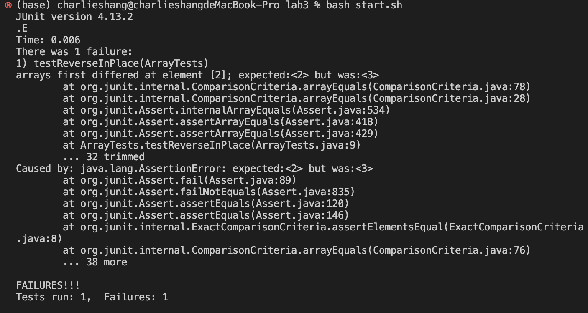
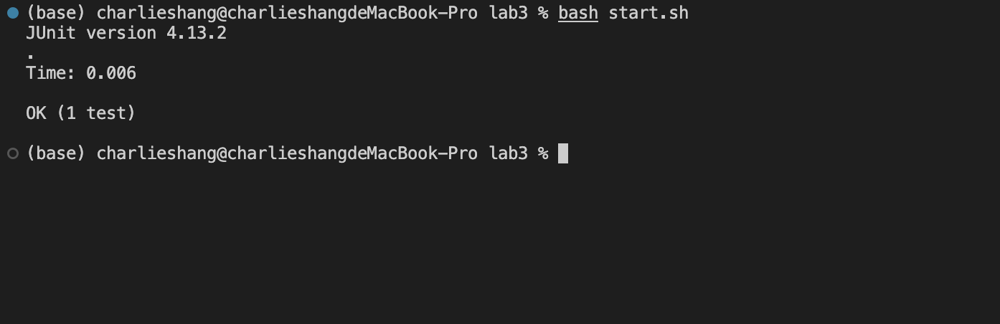

# CSE15L Lab Report Charlie Shang
## Lab 3 Report
### Part 1
I choose the method `reverseInPlace`.
The failure-inducing input is the int array [1,2,3,4].
The code of the buggy program is the following:
```
public class ArrayExamples {

  // Changes the input array to be in reversed order
  static void reverseInPlace(int[] arr) {
    for(int i = 0; i < arr.length; i += 1) {
      arr[i] = arr[arr.length - i - 1];
    }
  }

}
```
The code of the junit test is the following:
```
import static org.junit.Assert.*;
import org.junit.*;

public class ArrayTests {
	@Test 
	public void testReverseInPlace() {
    int[] input1 = { 1, 2, 3, 4 };
    ArrayExamples.reverseInPlace(input1);
    assertArrayEquals(new int[]{ 4, 3, 2, 1 }, input1);
	}

}
```
The bash script I use to run the code is the following:
```
javac -cp .:lib/hamcrest-core-1.3.jar:lib/junit-4.13.2.jar *.java
java -cp .:lib/hamcrest-core-1.3.jar:lib/junit-4.13.2.jar org.junit.runner.JUnitCore ArrayTests
```

The input that does not induce a failure is [1].
The codes of the buggy program and the bash script are the same as above.
The code of the junit test is the following:
```
import static org.junit.Assert.*;
import org.junit.*;

public class ArrayTests {
	@Test 
	public void testReverseInPlace() {
    int[] input1 = { 1 };
    ArrayExamples.reverseInPlace(input1);
    assertArrayEquals(new int[]{ 1 }, input1);
	}

}
```

The symptom of the first failure-inducing test is that the test fails to pass because the element at index 2 does not match the correct result, which is the following:
<br />
The symptom of the second non-failure-inducing test is that it passes the test, which is the following:
<br />

The bug of the program is that the `for` loop goes over the whole array, and every iteration it assigns the element at the back of the array to the front of the array, that is, assigning `array[n-i-1]` to `array[i]`. The problem is that since the `for` loop goes over the whole array, after the `for` loop goes over the first half of the array, which means the first half of the array now already contains the elements of the second half of the array, the `for` loop will continuing assigning the elements at the first half of the array to the second half of the array. However, since now the first half is already altered, it no longer contains the original elements of the first half of the array. Therefore, for the iteration of the `for` loop going over the second half of the array, it will just assign the altered values to the second half of the array, and these altered values are just the elements of the second half of the array. For example, if I have `[1,2,3,4]`. After the `for` loops goes over the first half the array, the array will become `[4,3,3,4]`. Therefore, when the `for` loop goes over the second half of the array, it will just assign 3 to 3 and 4 to 4, which makes the result `[4,3,3,4]`.
The buggy program is the following:
```
public class ArrayExamples {

  // Changes the input array to be in reversed order
  static void reverseInPlace(int[] arr) {
    for(int i = 0; i < arr.length; i += 1) {
      arr[i] = arr[arr.length - i - 1];
    }
  }
  
}
```
The fixed program is the following:
```
public class ArrayExamples {

  // Changes the input array to be in reversed order
  static void reverseInPlace(int[] arr) {
    for(int i = 0; i < arr.length / 2; i += 1) {
      int temp = arr[i];
      arr[i] = arr[arr.length - i - 1];
      arr[arr.length - i - 1] = temp;
    }
  }

}
```
I make the `for` loop just go over half of the array, and in every iteration, the program changes element at the current index as well as its corresponding index at the second half of the array. Therefore when `i=0`, the program switches the element stored at index `0` and index `n-i-1` which is `n-1` which is the last index. Also, the program now does not assign values directly. It first stores the element at the current index to a temporary variable such that when we switch the values at the two indexes, we make sure that a value stored at the second half of the array is the value already altered, just as the buggy program. This program stores the value in a temporary variable, and then assigns the value stored in the corresponding index of the second half of the array to the current index of the first half of the array, and then store the temporary variable, which is the original value at the index of the first half of the array, to the index at the second half of the array. Therefore, the switch completes. Going over just half of the array in the `for` loop is because during one iteration we already switches the array at the first and second half of the arrays and we do not want to switch back.

### Part 2
