# CSE15L Lab Report Charlie Shang
## Lab 4 Report
Steps are the following:
```
1. Setup Delete any existing forks of the repository you have on your account
2. Setup Fork the repository
3. The real deal Start the timer!
4. Log into ieng6
5. Clone your fork of the repository from your Github account (using the SSH URL)
6. Run the tests, demonstrating that they fail
7. Edit the code file to fix the failing test
8. Run the tests, demonstrating that they now succeed
9. Commit and push the resulting change to your Github account (you can pick any commit message!)
```

4. Log into ieng6 <br />
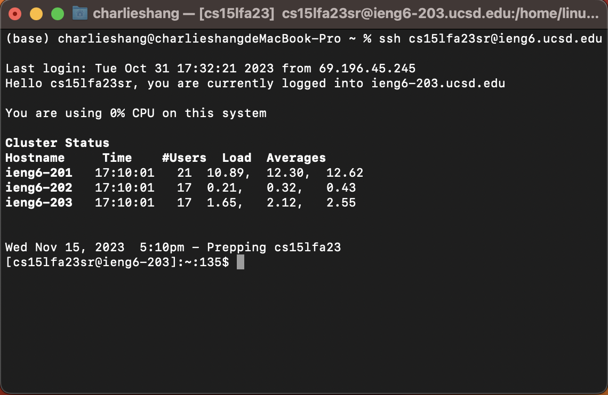<br />
The keys I pressed: <br />
I pressed `ssh cs15lfa23sr@ieng6.ucsd.edu` and then pressed `<enter>`<br/>
I typed `ssh` and my account to ssh connect to the school computer. The `<enter>` key is just to enter the command to the terminal.

5. Clone your fork of the repository from your Github account (using the SSH URL) <br />
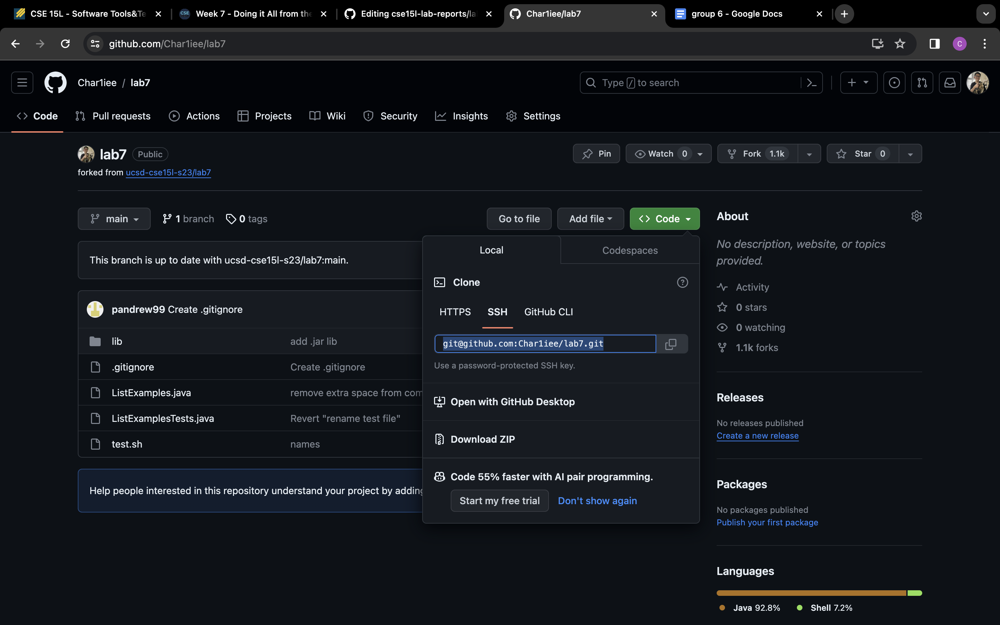<br />
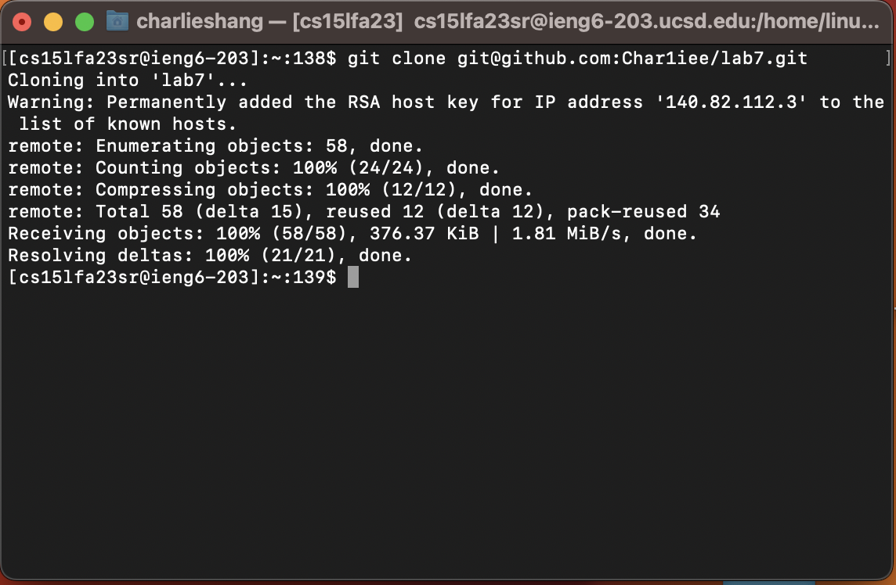<br />
The keys I pressed:
I first went to the webpage of my repository of lab7 and select the ssh link of the repo and pressed `<ctrl>c`. Then I went to the terminal and typed `git clone` and pressed `<ctrl>v` and pressed `<enter>`.
The first `<ctrl>c` command is to copy the ssh link of the repo so that I do not need to type it for a long time on the terminal. The `git clone ` I typed is to clone this repository to my local computer. The `<ctrl>v` is to paste the ssh link of the repository to the terminal. The `<enter>` is to enter the command to the terminal.

6. Run the tests, demonstrating that they fail<br />
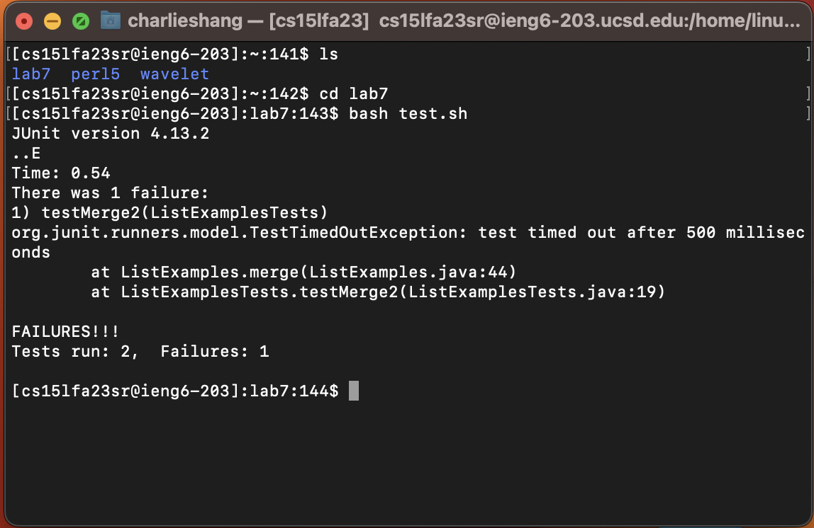<br />
The keys I pressed:
I first typed `ls` and pressed `<enter>`. Then I typed `cd l` and then pressed `<tab>` and pressed `<enter>`. Then I typed `bash t` and pressed `<tab>` and pressed `<enter>`.
Every `<enter>` key is to enter the command I typed to the terminal. `ls` command is to check if the directory `lab7` exists. After I checked this folder exists, I pressed `cd l` and pressed `<tab>` to enter this folder. The `<tab>` is to autofill the name of the folder, which is `lab7`. The whole command is to change the current directory to the `lab7` directory. I typed `bash t` and pressed `<tab>` to run the shell script. The `<tab>` here is also to autofill the name of the shell script, which is `test.sh`.

7. Edit the code file to fix the failing test<br />
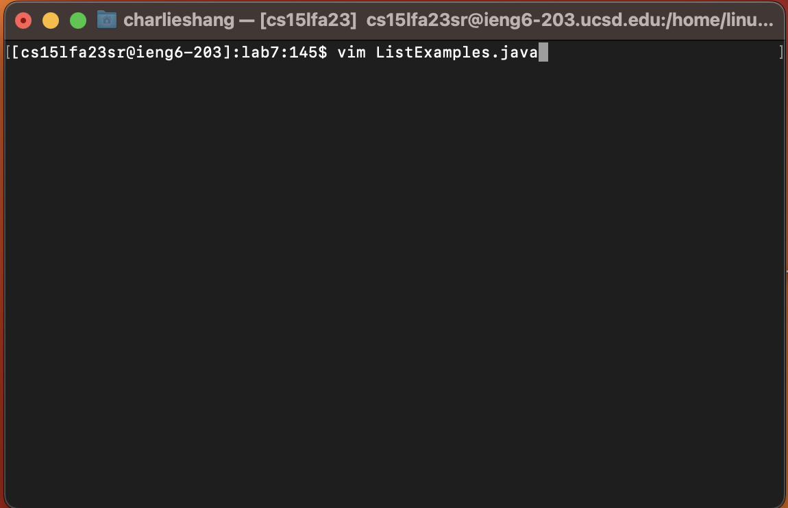<br />
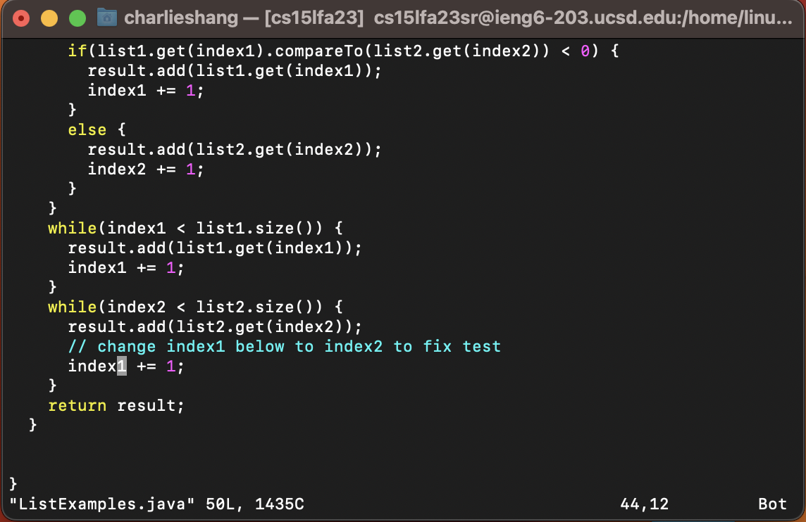<br />
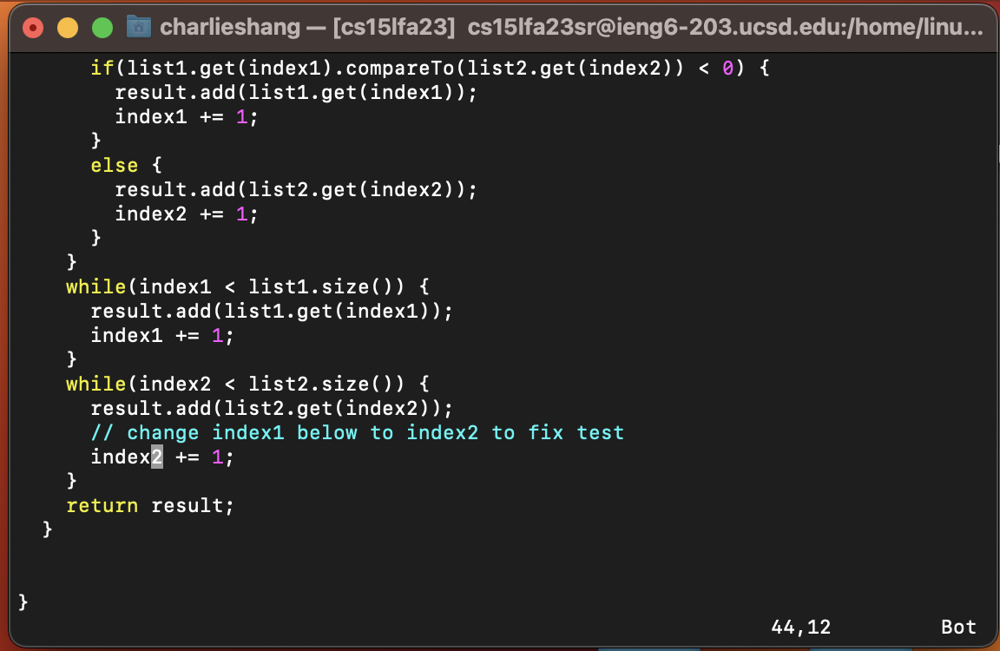<br />
The keys I pressed:
I first typed `vim List` and pressed `<tab>` and then typed `.java` and pressed `<enter>`. Then I typed `/index1` and pressed `n` several times. Then I move the cursor to the front of `index1` by pressing `<left arrow>` and pressed `ce` and typed `index2`. Then I pressed `<esc>`. Lastly, I pressed `:wq`.
All the `<enter>` keys in the above step is to enter the command into the terminal. The `<tab>` in the first command is to autofill the name of the java file that needs to be modified, which is `ListExamples.java`. Since I compile this file previously by shell script, there exists another file called `ListExamples.class`. So when I pressed `<tab>` it will autofill the name until `ListExamples`, which is why I need to type `.java` after pressing `<tab>`. The first command is to enter the vim editor to edit the file `ListExample.java`. After I enter the vim editor, I typed `/index1` to search for the word `index1`, since `/` is the command for searching in the file. I pressed `n` several times to find the correct `index1` that I need to modify, since there are several `index1` appeared in this file. After I pressed `<left arrow>` my cursor is on the first character of `index1`, and I pressed `ce` to delete the word `index1` and the vim editor entered insert mode. Then I pressed `index2` and pressed `<esc>` to return to command mode. Lastly, I pressed `:wq` to save the changes and exit the vim editor.

8. Run the tests, demonstrating that they now succeed
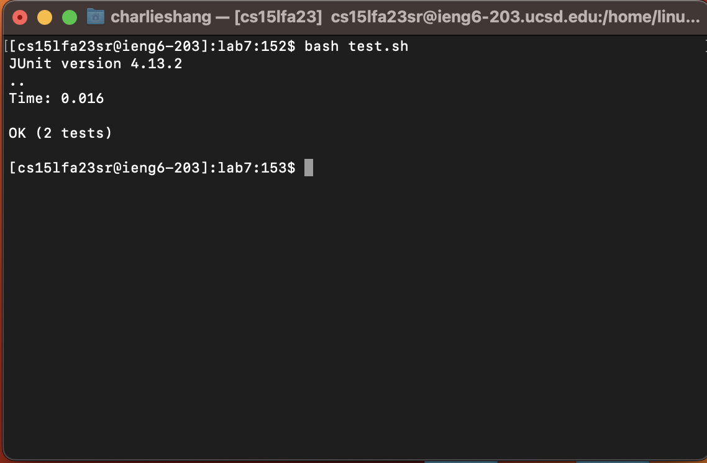<br />
The keys I pressed:
I typed `bash t` and pressed `<tab>` and pressed `<enter>`.
I typed `bash t` and pressed `<tab>` to autofill the name of the shell script, which is `test.sh` so that the command line becomes `bash test.sh`. The whole command is to run the shell script called `test.sh`. Then I pressed `<enter>` to enter the command into the terminal.

9. Commit and push the resulting change to your Github account (you can pick any commit message!)
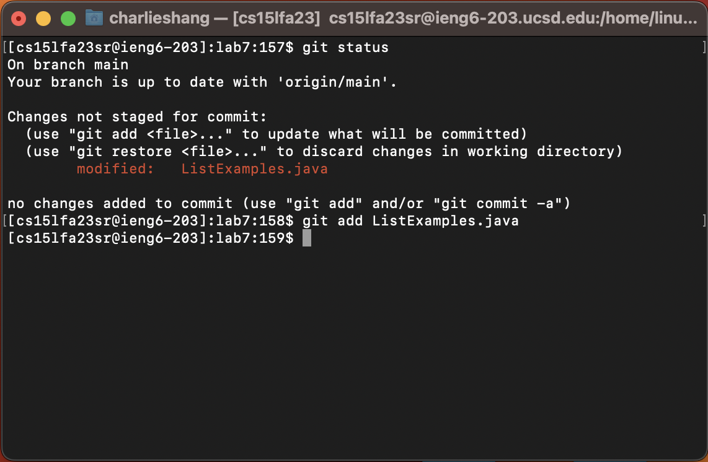<br />
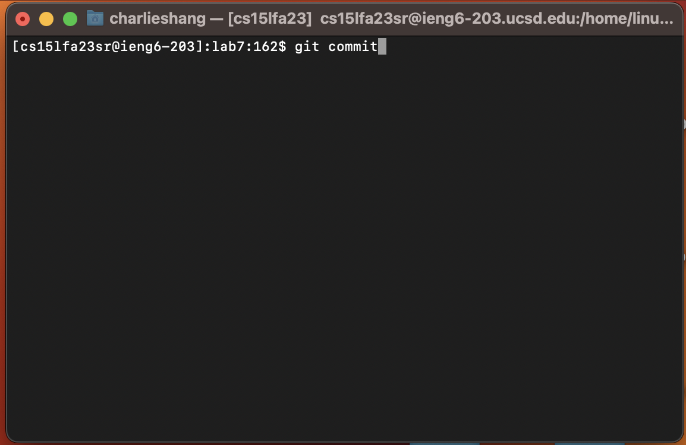<br />
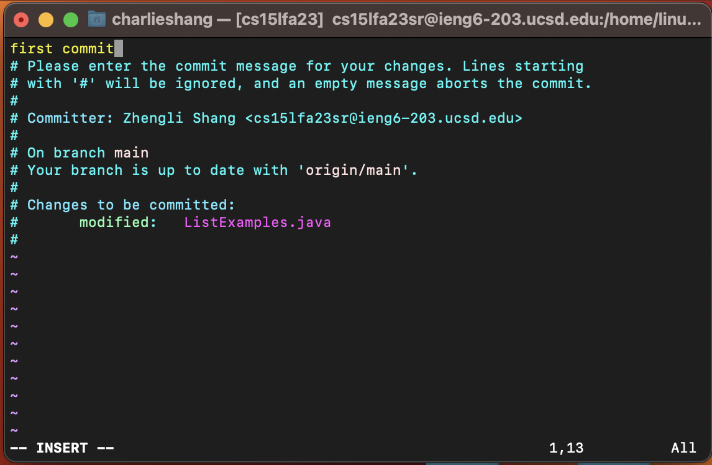<br />
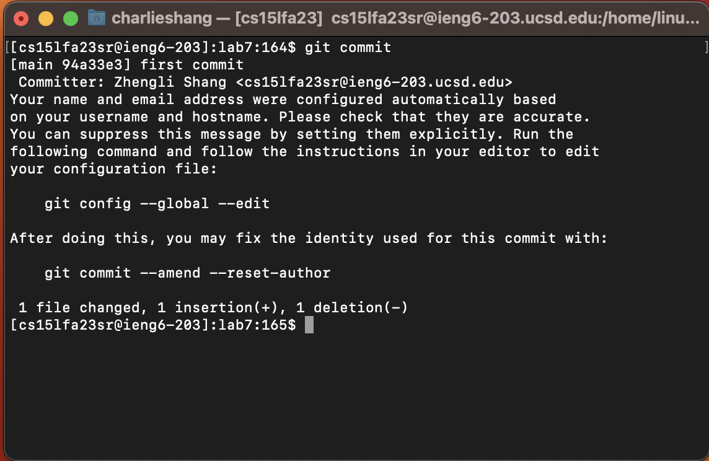<br />
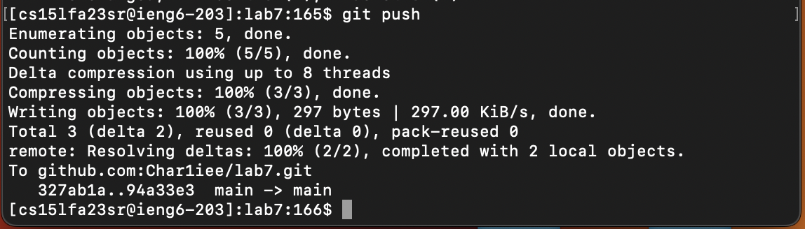<br />
The keys I pressed:
I pressed `git status` and `<enter>`. Then I pressed `git add Lis` and pressed `<tab>`, and pressed `<enter>`. Then I pressed `git commit`, and pressed `<enter>`, and pressed `i`, and typed `first commit`. Then I pressed `<esc>` and pressed `:wq`. Lastly, I pressed `git push` and pressed `<enter>`.
All the `<enter>` keys in the above step is to enter the command into the terminal. I pressed `git status` to check the change of fils that have not been added to the staging area, and I found `ListExamples.java` has not been added to the staging area. Therefore, I typed `git add Lis` and pressed `<tab>` to autofill the name of the file that is going to be added to the staging area, which is `ListExamples.java`, so that the command lind now becomes `git add ListExamples.java`. The whole command is to add the file `ListExamples.java` to the staging area of git. Then I pressed `<enter>` to enter the command to the terminal. I pressed `git commit` and pressed `<enter>` to commit the changes of my local git repository. After I enter this command, the terminal automatically enters vim editor to write the commit message. So I pressed `i` to enter insert mode and typed `first commit` as my commit message. Then I pressed `<esc>` to return to command mode and then pressed `:wq` to save the changes and exit the file. Lastly, I pressed `git push` and pressed `<enter>` to push my local repository to my remote repository so that the changes are synchronized for github.
