# CSE15L Lab Report Charlie Shang
## Lab 4 Report
### Part 1
Step 1:<br />
The post made by the student would be the following:<br />
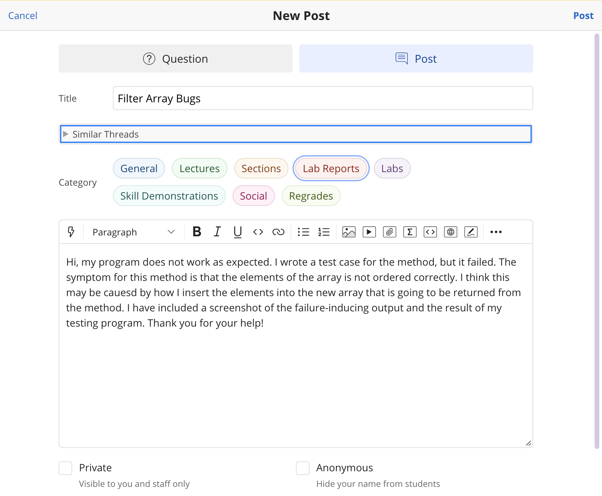<br />
The failure-inducing output is the following:<br />
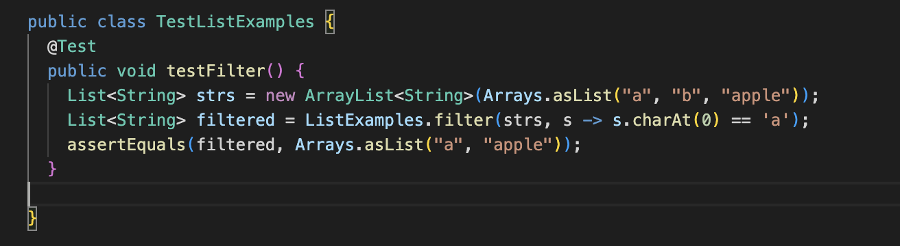<br />
The result of the testing program is the following:<br />
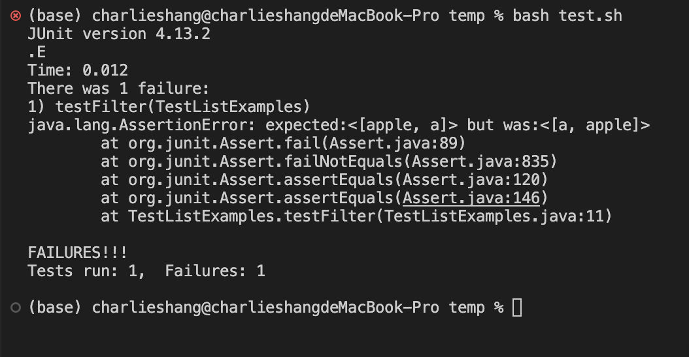<br />

Step 2:<br />
The response from a TA would be the following:<br />
How you filter the words seems working fine because you get the words you want. The problem is how you insert the correct word into the new arraylist. Since you just used two words with their first letter being "a", I recommend adding a few more words with their first letter being "a" and see what the result is. This should help you go over how your function order the words.

Step 3:<br />
The student following the advice given by the TA is the following:
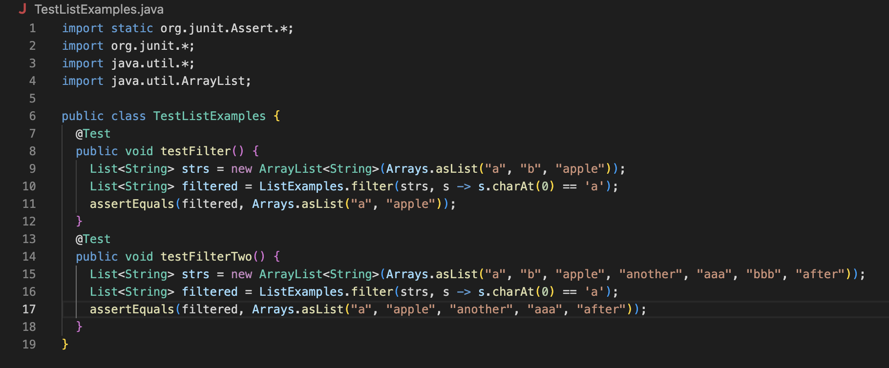<br />
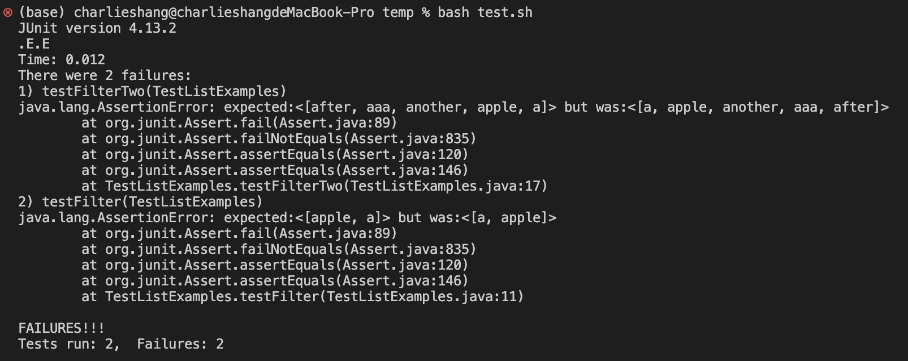<br />
The description of the bug is the following:<br />
Based on the screenshots above, the result of running testing cases with more words with their first letter being "a" is that the result of the method is in the opposite order of the expected result. This means that the problem should be something about how the student inserts the word to the arraylist returned from the method. Based on the original content of the code below, we can see that how the student insert the correct word is `result.add(0, s);`, which always insert the correct word at the front of the array instead of at the end. This is the bug.

Step 4:<br />
The file and directory structure is the following:
```
temp/
  lib/
    hamcrest-core-1.3.jar
    junit-4.13.2.jar
  ListExamples.java
  TestListExamples.java
  test.sh
```
The content of each file before fixing the bug:<br />
The two files inside the `lib/` directory are junit files to run junit test.<br />
The content of `ListExamples.java` before fixing the bug is the following:<br >
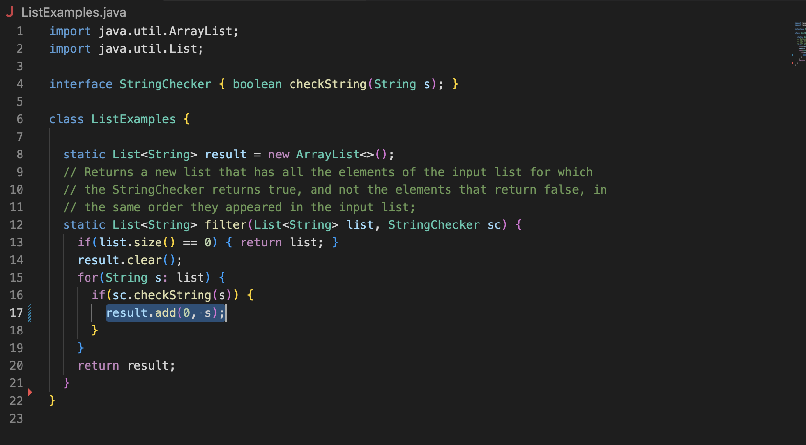<br />
The content of `TestListExamples.java` before fixing the bug is the following:<br >
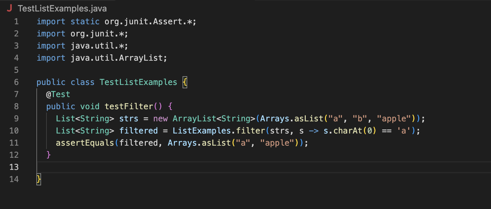<br />
The content of `test.sh` is the following:<br />
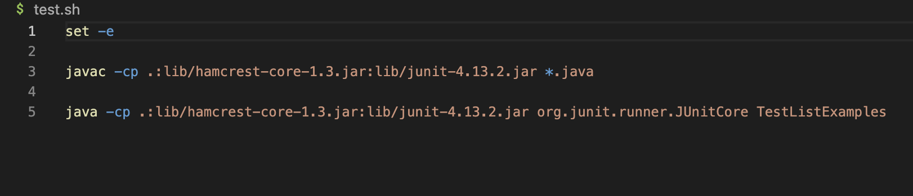<br />
The command line I ran to trigger the bug is the following:<br />
```
bash test.sh
```
This is to run the bash script to run the test cases.
To fix the bug, in the file `ListExamples.java`, I need to replace the line `result.add(0, s);` with `result.add(s);`. This line will make the program insert the correct words to the end of the arraylist `result` instead of to the front.<br />
The content of `ListExamples.java` after fixing the bug is the following:<br />
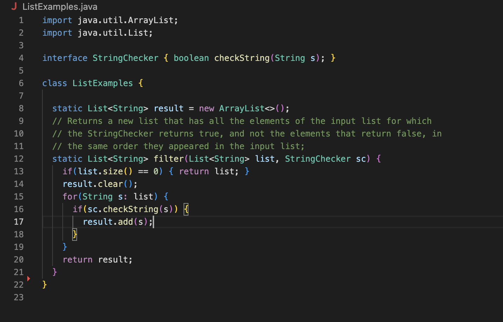<br />
The content of `TestListExamples.java` after fixing the bug is the following:<br >
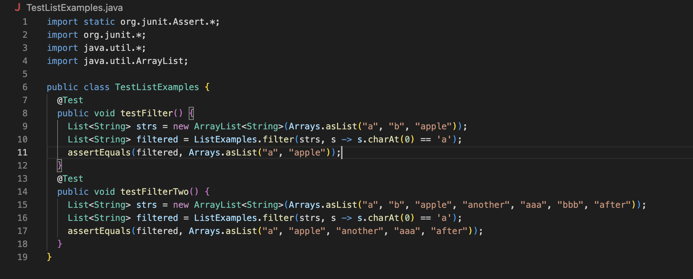<br />
The result of running tests on the modified files after fixing the bug is the following:<br />
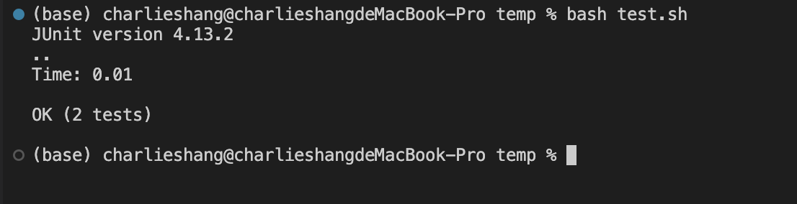<br />

### Part 2
In the second half of the course, I learned how to write shell scripts so that I do not need to type commands on the terminal redundantly. I also learned that bash script can be used to fulfill specific purposes such as gradescope grading. I also learned how to effectively use command lines to edit files using vim editor and to use git commands to manage my local repository as well as remote repository on github, which is pretty useful especially when I enter the industry in the future. Another thing I have learned is to use debugger to debug my program. The jdb is very useful in the sense that I can easily go through the process of debugging with it and figure out where the program goes wrong.
